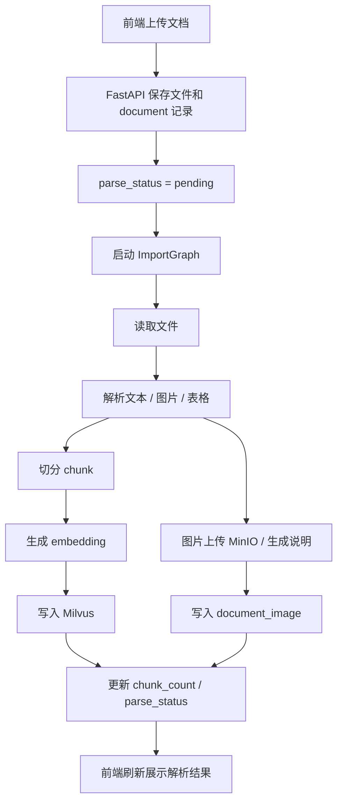
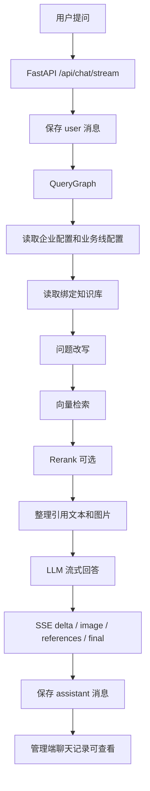

# 文档管理与聊天记录接口流程

本文整理当前前端已经接入的文档管理、聊天记录相关接口，以及后续需要补齐的主要业务流程。

当前版本目标不是一次性写完整 RAG 解析和查询链路，而是先把“页面能调通后端、数据落到正确位置、后续 TODO 清楚”这条基础链路搭起来。

## 一、文档管理

### 1. 数据存储

文档元数据使用 MySQL。

主要表：

- `document`：保存文档基础信息、所属知识库、解析状态、chunk 数量、图片数量和错误信息。
- `document_image`：保存文档解析出的图片信息，包括图片地址、说明和 alt 文本。
- `knowledge_base`：通过 `doc_count`、`chunk_count` 汇总文档数量和 chunk 数量。

当前上传文件先保存到本地：

```text
app/resources/uploads/{doc_id}/{filename}
```

该目录属于运行产物，已加入 `.gitignore`。

### 2. 接口列表

#### 查询文档列表

```http
GET /admin/documents/list
```

请求参数：

| 参数 | 类型 | 必填 | 说明 |
| --- | --- | --- | --- |
| `kb_id` | string | 否 | 按知识库过滤 |
| `parse_status` | string | 否 | 按解析状态过滤，可选 `pending`、`parsing`、`success`、`failed` |
| `keyword` | string | 否 | 按文件名模糊搜索 |

响应：

```json
{
  "items": [
    {
      "doc_id": "doc_xxx",
      "kb_id": "kb_course",
      "kb_name": "课程知识库",
      "filename": "rag.md",
      "file_type": "md",
      "file_path": "app/resources/uploads/doc_xxx/rag.md",
      "minio_url": "",
      "parse_status": "pending",
      "chunk_count": 0,
      "image_count": 0,
      "error_msg": "",
      "created_at": "2026-06-13 12:00:00",
      "updated_at": "2026-06-13 12:00:00",
      "images": []
    }
  ]
}
```

前端使用位置：

- 文档管理页表格。
- 首页最近文档。

#### 查询最近文档

```http
GET /admin/documents/recent
```

响应结构同文档列表，只返回最近 5 条。

当前前端首页直接复用 `/admin/documents/list` 的前 5 条渲染，因此该接口主要预留给后续优化。

#### 查询文档详情

```http
GET /admin/documents/{doc_id}
```

路径参数：

| 参数 | 类型 | 说明 |
| --- | --- | --- |
| `doc_id` | string | 文档 ID |

响应字段同列表单项，额外重点展示：

- `file_path`
- `parse_status`
- `chunk_count`
- `image_count`
- `error_msg`
- `images`

前端使用位置：

- 文档管理页点击“详情”后打开弹窗。

#### 上传文档

```http
POST /admin/documents/upload
Content-Type: multipart/form-data
```

请求参数：

| 参数 | 类型 | 必填 | 说明 |
| --- | --- | --- | --- |
| `kb_id` | string | 是 | 所属知识库 ID |
| `file` | file | 是 | 上传文件 |

响应：

```json
{
  "success": true,
  "doc_id": "doc_xxx",
  "task_id": "task_xxx",
  "message": "已保存文档，等待解析实现"
}
```

当前已实现：

- 校验知识库是否存在。
- 生成 `doc_id`、`task_id`。
- 保存文件到 `app/resources/uploads`。
- 写入 `document` 表。
- 设置 `parse_status = pending`。
- 刷新知识库 `doc_count`、`chunk_count`。

后续 TODO：

- 上传后启动文档解析任务。
- 根据文件类型调用不同解析器。
- 抽取文本、图片、表格等结构化内容。
- 切分 chunk。
- 调用 embedding。
- 写入 Milvus。
- 写入 `document_image`。
- 解析成功后更新 `parse_status = success`。
- 解析失败后更新 `parse_status = failed` 和 `error_msg`。

#### 重新解析文档

```http
POST /admin/documents/{doc_id}/reparse
```

响应：

```json
{
  "success": true,
  "message": "已提交重解析占位任务",
  "data": {
    "doc_id": "doc_xxx",
    "parse_status": "pending"
  }
}
```

当前已实现：

- 将文档状态重置为 `pending`。
- 清空 `error_msg`。
- 将 `chunk_count`、`image_count` 重置为 0。
- 刷新知识库统计。

后续 TODO：

- 删除旧 Milvus chunk。
- 删除或更新旧图片记录。
- 重新执行解析图。
- 避免重复任务并发执行。

#### 删除文档

```http
POST /admin/documents/{doc_id}/delete
```

响应：

```json
{
  "success": true,
  "message": "文档已删除",
  "data": {
    "doc_id": "doc_xxx"
  }
}
```

当前已实现：

- 删除 `document_image` 记录。
- 删除 `document` 记录。
- 删除本地上传文件。
- 刷新知识库统计。

后续 TODO：

- 删除 Milvus 中对应 chunk。
- 删除 MinIO 或对象存储中的原始文件和图片。
- 如果接入异步任务，需要处理“解析中删除”的状态竞争。

### 3. 文档解析建议流程



建议 LangGraph 节点：

- `load_document_node`：读取 `document` 和文件路径。
- `detect_file_type_node`：判断解析方式。
- `parse_text_node`：解析文本内容。
- `extract_images_node`：抽取图片。
- `caption_images_node`：给图片生成说明。
- `split_chunks_node`：切分 chunk。
- `embed_chunks_node`：生成向量。
- `save_vector_node`：写入 Milvus。
- `save_document_images_node`：保存图片元数据。
- `update_document_status_node`：更新解析状态和统计。
- `handle_import_error_node`：统一记录失败原因。

## 二、聊天记录

### 1. 数据存储

聊天记录使用 MongoDB。

集合设计：

- `chat_sessions`：一条会话一条记录，保存 `session_id`、业务线、最后消息、消息数、更新时间等。
- `chat_messages`：一条消息一条记录，保存角色、内容、引用来源、图片、改写问题等。

当前后端已经做了容错：

- MongoDB 可用时正常读写。
- MongoDB 不可用时，管理端接口返回空列表和提示，不影响 MySQL 配置管理页面。

### 2. 管理端接口

#### 查询会话列表

```http
GET /admin/chat-sessions/list
```

响应：

```json
{
  "items": [
    {
      "_id": "mongo_object_id",
      "session_id": "session_xxx",
      "company_id": "default_company",
      "business_line_id": "business_line_course",
      "business_line_name": "课程助手",
      "updated_at": "2026-06-13T12:00:00+00:00",
      "last_message": "用户最后一条问题或助手最后一条回答",
      "subject_names": [],
      "message_count": 2,
      "created_at": "2026-06-13T12:00:00+00:00"
    }
  ],
  "available": true
}
```

如果 MongoDB 不可用：

```json
{
  "items": [],
  "available": false,
  "message": "MongoDB 聊天记录暂不可用：..."
}
```

前端使用位置：

- 聊天记录页表格。
- 首页最近会话。

#### 查询会话详情

```http
GET /admin/chat-sessions/{session_id}
```

响应：

```json
{
  "session_id": "session_xxx",
  "available": true,
  "messages": [
    {
      "_id": "mongo_object_id",
      "session_id": "session_xxx",
      "role": "user",
      "content": "RAG 的流程是什么？",
      "rewritten_query": "",
      "subject_names": [],
      "image_urls": [],
      "references": [],
      "created_at": "2026-06-13T12:00:00+00:00"
    },
    {
      "_id": "mongo_object_id",
      "session_id": "session_xxx",
      "role": "assistant",
      "content": "回答内容",
      "references": []
    }
  ]
}
```

前端使用位置：

- 聊天记录页点击“查看”后打开详情弹窗。

#### 清空单个会话

```http
POST /admin/chat-sessions/{session_id}/clear
```

响应：

```json
{
  "success": true,
  "message": "会话已清空",
  "data": {
    "session_id": "session_xxx",
    "deleted_count": 10
  }
}
```

当前行为：

- 删除该 `session_id` 下的 `chat_messages`。
- 将 `chat_sessions.message_count` 重置为 0。
- 清空 `last_message`。

#### 清空全部会话

```http
POST /admin/chat-sessions/clear-all
```

响应：

```json
{
  "success": true,
  "message": "全部会话已清空",
  "data": {
    "deleted_count": 100
  }
}
```

当前行为：

- 删除全部 `chat_messages`。
- 删除全部 `chat_sessions`。

### 3. 用户侧聊天接口

#### 流式问答

```http
POST /api/chat/stream
Content-Type: application/json
```

请求：

```json
{
  "session_id": "session_xxx",
  "message": "RAG 的流程是什么？",
  "company_id": "default_company",
  "business_line_id": "business_line_course"
}
```

返回类型：

```http
Content-Type: text/event-stream
```

当前 SSE 事件：

| event | 说明 |
| --- | --- |
| `ready` | 连接建立 |
| `progress` | 当前处理步骤和进度 |
| `delta` | LLM 增量文本 |
| `image` | 需要前端展示的图片数据 |
| `references` | 引用来源 |
| `final` | 最终完整回答 |
| `error` | 错误信息 |

`progress` 示例：

```json
{
  "step": "retrieve",
  "label": "检索相关资料",
  "current": 3,
  "total": 4,
  "percent": 75,
  "message": "检索相关资料"
}
```

`image` 示例：

```json
{
  "placement": "inline",
  "message": "后续如果检索结果包含图片，可以在这里展示。",
  "images": [
    {
      "url": "/resource/images/xxx.png",
      "caption": "流程图"
    }
  ]
}
```

当前已实现：

- 收到问题后尝试写入一条 user 消息。
- 返回占位 progress。
- 返回占位 delta 文本。
- 返回 image 事件结构。
- 返回 references 事件结构。
- final 后尝试写入 assistant 消息。
- MongoDB 不可用时不阻断问答流。

后续 TODO：

- 接入 QueryGraph。
- 根据 `business_line_id` 读取业务线配置。
- 读取该业务线绑定且启用的知识库。
- 执行问题改写。
- 检索 Milvus。
- 可选 rerank。
- 汇总文本 chunk 和图片 chunk。
- 组织 Prompt。
- 调用 LLM 流式生成。
- 发送真实 `progress`、`delta`、`image`、`references`、`final`。
- 将最终回答和引用写入 MongoDB。

#### 查询单个会话历史

```http
GET /api/chat/history?session_id=session_xxx&business_line_id=business_line_course
```

响应：

```json
{
  "session_id": "session_xxx",
  "business_line_id": "business_line_course",
  "messages": []
}
```

当前用途：

- 给聊天框恢复历史消息预留。
- 当前聊天框主要用 localStorage 做前端本地历史，后续可以改成从该接口读取 MongoDB 历史。

### 4. 查询建议流程



建议 LangGraph 节点：

- `load_runtime_config_node`：读取企业、模型、业务线配置。
- `load_bound_kbs_node`：读取当前业务线绑定且启用的知识库。
- `rewrite_query_node`：改写用户问题。
- `retrieve_chunks_node`：向量检索。
- `rerank_chunks_node`：可选 rerank。
- `collect_images_node`：整理与回答相关的图片。
- `build_prompt_node`：组装 Prompt。
- `generate_answer_node`：流式生成回答。
- `emit_progress_node`：按步骤向前端推送进度。
- `emit_references_node`：推送引用来源。
- `save_chat_history_node`：保存助手回答和引用。
- `handle_query_error_node`：统一错误事件和降级文案。

## 三、前端联动说明

当前前端已做的联动：

- 文档管理页从 `/admin/documents/list` 加载真实数据。
- 上传文档调用 `/admin/documents/upload`。
- 文档详情调用 `/admin/documents/{doc_id}`。
- 重解析调用 `/admin/documents/{doc_id}/reparse`。
- 删除文档调用 `/admin/documents/{doc_id}/delete`。
- 聊天记录页从 `/admin/chat-sessions/list` 加载真实数据。
- 聊天详情调用 `/admin/chat-sessions/{session_id}`。
- 清空会话调用 `/admin/chat-sessions/{session_id}/clear`。
- 清空全部调用 `/admin/chat-sessions/clear-all`。
- 后台问答测试调用 `/api/chat/stream`，展示 SSE 进度和回答。

已移除的前端假数据：

- 首页统计的静态数字。
- 首页最近文档和最近会话静态行。
- 文档管理静态行。
- 聊天记录静态行。
- 企业信息和模型配置表单默认假值。
- 新建业务线、新建知识库弹窗默认假值。
- 后台问答测试静态业务线、静态回答和静态引用。

## 四、你后续练习优先级

建议按这个顺序补：

1. 文档解析任务：先支持 Markdown / TXT。
2. chunk 切分和 MySQL 统计更新。
3. Milvus 写入和删除。
4. QueryGraph 检索真实 chunk。
5. SSE progress 与真实节点对应。
6. 引用来源返回真实文档、chunk、score。
7. 图片解析和 `image` SSE 事件展示。
8. 聊天框从 `/api/chat/history` 恢复 MongoDB 历史。

